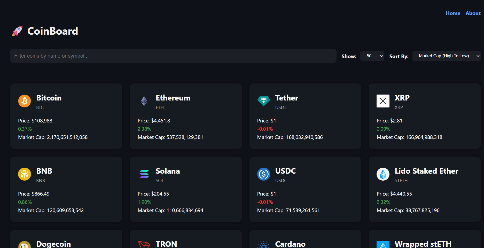

# CoinBoard - Crypto Dashboard

CoinBoard is a modern React application that displays live cryptocurrency data using the CoinGecko API. It allows users to explore the top cryptocurrencies by market cap, filter and sort them, and view detailed information and charts for each coin.

## Features

- 🔥 Live cryptocurrency data (powered by CoinGecko API)
- 🔍 Filter coins by name or symbol
- ↕️ Sort by market cap, price, or 24h change
- 📊 View detailed coin information and 7-day price chart
- 🎛️ Select how many coins to display
- ⚡ Fast, modern UI built with React and Vite

## Screenshots



## Getting Started

### Prerequisites

- Node.js (v18 or newer recommended)
- npm

### Installation

1. **Clone the repository:**

   ```sh
   git clone https://github.com/yourusername/crypto-dashboard.git
   cd crypto-dashboard
   ```

2. **Install dependencies:**

   ```sh
   npm install
   ```

3. **Set up environment variables:**

   - Create a `.env.local` file in the root directory.
   - Add the following (replace with your API endpoint if needed):
     ```
     VITE_COINS_API_URL=https://api.coingecko.com/api/v3/coins/markets?vs_currency=usd
     VITE_COIN_API_URL=https://api.coingecko.com/api/v3/coins
     ```

4. **Start the development server:**

   ```sh
   npm run dev
   ```

5. **Open in your browser:**
   - Visit [http://localhost:5173](http://localhost:5173)

### Build for Production

```sh
npm run build
```

### Lint the code

```sh
npm run lint
```

## Project Structure

```
src/
  App.jsx
  main.jsx
  index.css
  components/
	 CoinCard.jsx
	 CoinChart.jsx
	 FilterInput.jsx
	 Header.jsx
	 LimitSelector.jsx
	 SortSelector.jsx
	 Spinner.jsx
  pages/
	 about.jsx
	 coin-details.jsx
	 home.jsx
	 not-found.jsx
public/
  favicon.ico
  vite.svg
```

## Dependencies

- [React](https://react.dev/)
- [Vite](https://vitejs.dev/)
- [react-router](https://reactrouter.com/)
- [chart.js](https://www.chartjs.org/) & [react-chartjs-2](https://react-chartjs-2.js.org/)
- [react-spinners](https://www.davidhu.io/react-spinners/)
- [date-fns](https://date-fns.org/)

---

Made with ❤️ for learning and exploring React!
